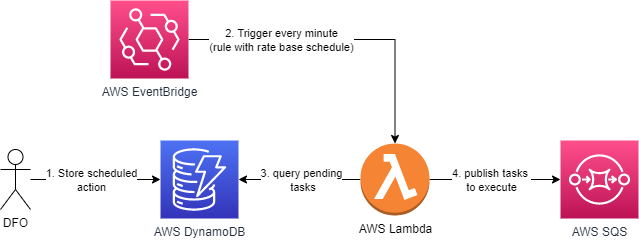

# WFA Scheduler

POC WFA Scheduler based on AWS serverless stack.

## Requirements for enterprise grade scheduling

- ***High precision (delivery time)***
	-  Events delivered as close as possible to scheduled delivery time.
- ***High precision (granularity)***
	-  High granularity of possible delivery time (i.e. 1 minute precision instead of 15 minute precision).
- ***Scale (# of pending task)***
	- Target solution must support large number of scheduled tasks (millions) waiting to be executed.
- ***Scale (# of task to be executed at the same time)***
	- Target solution must be able to execute many tasks (millions) in parallel at the same time. This implies quick retrieval of events to be executed from underlying storage.
- ***Low TCO***
	- Ideally serverless solution that can scale in and out flexibily without extensive administration and maintenance.
	- Acceptable costs for target solution capacity.

## DFO Context

This kind of scheduler will be used for supporting DFO WFA triggers with delayed execution. Trigegr can be delayed up to 1 day and can operate on case level -> big numbers of scheduled jobs. 

## Target solution

Combination of following serverless AWS services will be used:

</br>

1. DFO stores one-off event to be executed in the future (deffered WFA action) into DynamoDB. Event is put into dedicated partition based on delivery time.
2. Generic AWS Eventbridge rule with rate based schedule (every 1 minute) triggers lambda function.
3. Lambda will use current time to calculate current and previous partition for data retrieval and retrieve all jobs/tasks to execute
4. Taks/jobs will be pushed into AWS SQS for asynchronous processing by respective consumer(s).

## Technical notes

Some helper technical ntoes below...

### JSON event data

Sample AWS EventBridge event (received by lamdba function):

```json
{
	'version': '0',
	'id': '93ea9825-264f-90fd-16a7-d640d156f5e9',
	'detail-type': 'Scheduled Event',
	'source': 'aws.events',
	'account': '287378523389',
	'time': '2022-01-24T11:51:18Z',
	'region': 'eu-central-1',
	'resources': ['arn:aws:events:eu-central-1:287378123456:rule/serverless-scheduler-SchedulerFunctionDispatchJobs-1SXUZFVOXE0EP'],
	'detail': {}
}
```

Sample DynamoDB payload (when **View DynamoDB JSON** is disabled) as stored by DFO (details section just for ilustration we can store arbitrary data):

```json
{
  "pk": "j#2015-03-20T09:45",
  "sk": "2015-03-20T09:46:47.123Z#564ade05-efda-4a2e-a7db-933ad3c89a83",
  "detail": {
    "action": "send-reminder",
    "userId": "16f3a019-e3a5-47ed-8c46-f668347503d1",
    "taskId": "6d2f710d-99d8-49d8-9f52-92a56d0c6b81",
    "params": {
      "foo": "bar"
    }
  }
}
```

### DynamoDB Partitions

We are using composite primary key (Details see [here](https://aws.amazon.com/blogs/database/choosing-the-right-dynamodb-partition-key/))

- **pk** represents the partition (can be shared by many items). This is the partition key, for calculation see below.
- **sk** represents sorting key. This is the due date of the job (when scheduler should be triggered) together with job ID to ensure uniqueness of the attribute.

pl + sk value must be **uniqueue** for every item as these attributes together represent primary key of item.

More details [here] (https://docs.aws.amazon.com/amazondynamodb/latest/developerguide/HowItWorks.Partitions.html)

#### Partitions RCU/WCU limits

3,000 RCUs or 1,000 WCUs per partition.

On demand capacity mode, see [pricing example](https://aws.amazon.com/dynamodb/pricing/on-demand/).

#### Partitions calculation

Partition kety pk is calculated based on minute in sk attribute as follows

```python
f'{(sk_minutes – sk_minutes % 5):02d}'
```

This can be expressed with following table:

| "sk" minutes   | "pk" minutes  | "sk" minutes | "pk" minutes  |
|----------------|-----|----------------|-----|
| 0,1,2,3,4      | 00  | 5,6,7,8,9      | 05  |
| 10,11,12,13,14 | 10  | 15,16,17,18,19 | 15  |
| 20,21,22,23,24 |  20 | 25,26,27,28,29 | 25  |
| 30,31,32,33,34 |  30 | 35,36,37,38,39 | 35  |
| 40,41,42,43,44 |  40 | 45,46,47,48,49 | 45  |
| 50,51,52,53,54 | 50  | 55,56,57,58,89 | 55  |


See/run sample https://www.programiz.com/python-programming/online-compiler/

Script:

```python
from datetime import timedelta
import dateutil.parser

partition_interval_in_minutes = 5

def get_partitions(event_time_in_utc):
    date_hour, strminute, *_ = event_time_in_utc.split(':')
    
    print("date_hour=" + date_hour)
    print("strminute=" + strminute)
    
    minute = int(strminute)

    current_partition = f'{date_hour}:{(minute - minute % partition_interval_in_minutes):02d}'
    print("current_partition=" + current_partition)
    
    current_partition_date_time = dateutil.parser.parse(current_partition)
    print("current_partition_date_time=" + str(current_partition_date_time))
    previous_partition_date_time = current_partition_date_time - \
        timedelta(minutes=partition_interval_in_minutes)
        
    print("previous_partition_date_time=" + str(previous_partition_date_time))
    
    previous_partition = previous_partition_date_time.strftime(
        '%Y-%m-%dT%H:%M')

    print("previous_partition=" + previous_partition)

    return previous_partition, current_partition

previous_partition, current_partition = get_partitions("2022-01-24T11:57:12Z")
print("previous_partition=" + previous_partition)
print("current_partition=" + current_partition)
```

will produce following partitions:

```
date_hour=2022-01-24T11
strminute=57
current_partition=2022-01-24T11:55
current_partition_date_time=2022-01-24 11:55:00
previous_partition_date_time=2022-01-24 11:50:00
previous_partition=2022-01-24T11:50
previous_partition=2022-01-24T11:50
current_partition=2022-01-24T11:55
```
## Links

Resources used for initial analysis

* https://dev.to/aws-builders/delayed-event-processing-part-1-40pa
* https://medium.com/swlh/how-to-get-past-the-15-minute-delay-limit-in-amazon-sqs-fba3c50daf0b
* https://theburningmonk.com/2019/03/dynamodb-ttl-as-an-ad-hoc-scheduling-mechanism/
* https://aws.amazon.com/blogs/architecture/serverless-scheduling-with-amazon-eventbridge-aws-lambda-and-amazon-dynamodb/
* https://dev.to/rohanmehta_dev/scheduled-task-processing-with-dynamodb-and-eventbridge-439c
* https://aws.amazon.com/premiumsupport/knowledge-center/primary-key-dynamodb-table/
* https://aws.amazon.com/blogs/database/choosing-the-right-dynamodb-partition-key/
* https://docs.aws.amazon.com/amazondynamodb/latest/developerguide/bp-partition-key-sharding.html
* https://docs.aws.amazon.com/amazondynamodb/latest/developerguide/HowItWorks.Partitions.html
* https://docs.aws.amazon.com/amazondynamodb/latest/developerguide/HowItWorks.ReadWriteCapacityMode.html
* https://docs.aws.amazon.com/amazondynamodb/latest/developerguide/HowItWorks.ReadConsistency.html
* https://aws.amazon.com/dynamodb/pricing/on-demand/
* https://docs.aws.amazon.com/amazondynamodb/latest/developerguide/GettingStarted.Python.html